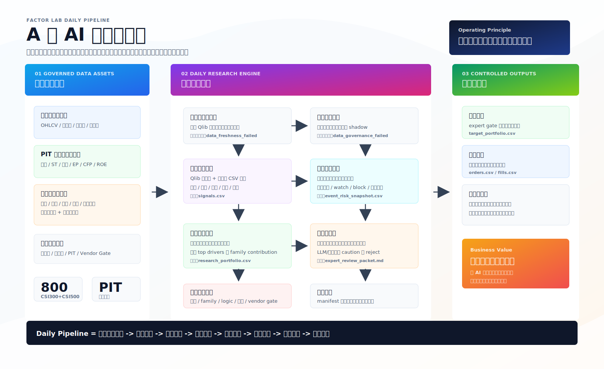
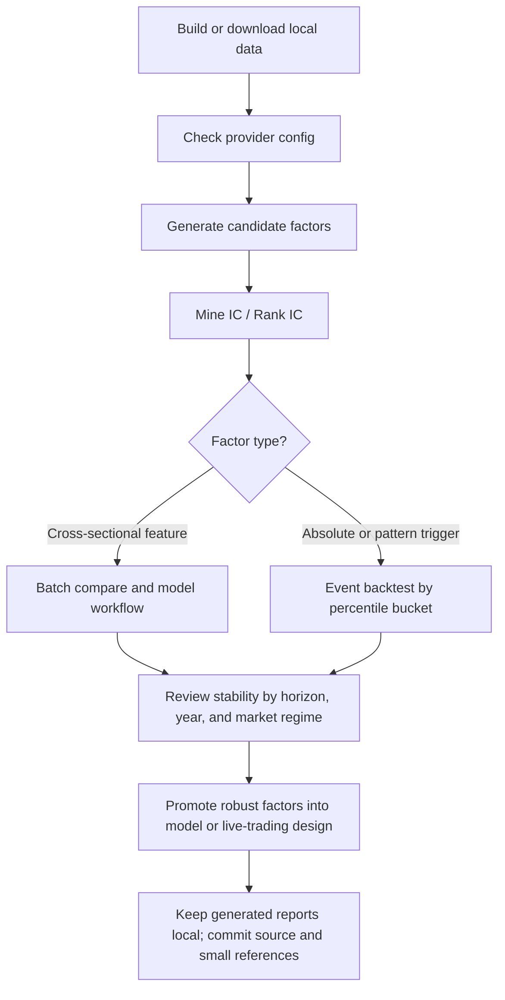

# Qlib Factor Lab

Qlib Factor Lab is a lightweight research scaffold for A-share factor work. It keeps factor definitions, data-building scripts, single-factor evaluation, event backtests, and model workflow generation in one small Python package.

The current project focuses on:

- Formula-style price, volume, turnover, volatility, reversal, and pattern factors.
- CSI500 and CSI300 local research datasets built from AkShare.
- JoinQuant factor-library migration candidates that can be expressed with local OHLCV and turnover fields.
- A factor-to-live-trading design note under `docs/superpowers/specs/`.

## Platform Loop



Factor Lab follows one conservative operating loop: govern the data first, research factors inside bounded lanes, combine approved factor families, then pass every portfolio through review gates before paper execution.

Generated market data, Qlib binaries, MLflow records, and backtest reports are intentionally ignored by Git. See [docs/data-and-artifacts.md](docs/data-and-artifacts.md).

For a compact command-by-command example, see [docs/factor-research-path.md](docs/factor-research-path.md).

For the unified North-Star blueprint covering data governance, multi-lane autoresearch, stock cards, family-first portfolios, and expert review, see [docs/factor-lab-north-star-blueprint.md](docs/factor-lab-north-star-blueprint.md).

For the current repo evolution roadmap from alpha research to daily signal, paper trading, and manual-live readiness, see [docs/superpowers/plans/2026-04-23-factor-lab-evolution-blueprint.md](docs/superpowers/plans/2026-04-23-factor-lab-evolution-blueprint.md).

## Project Layout

```text
configs/                 Provider, factor-mining, and model configs
docs/                    Design notes and operating docs
factors/                 Factor registry and candidate-family notes
reports/joinquant_factorlib/
                         Small JoinQuant factor-library snapshots
scripts/                 CLI commands for data, factors, events, models
src/qlib_factor_lab/     Reusable Python package
tests/                   Unit tests that do not require downloaded data
```

## Research Flow



The loop is intentionally conservative: use IC/Rank IC for broad triage, event backtests for trigger-like signals, then require horizon, yearly, and market-regime checks before a factor graduates.

## Quick Start

Create a local environment:

```bash
python3 -m venv .venv
source .venv/bin/activate
python -m pip install --upgrade pip
python -m pip install -r requirements.txt
python -m pip install -e .
```

Run the unit tests:

```bash
make test
```

Start the local Streamlit research workbench:

```bash
make workbench
```

The workbench is a read-only local UI. It reads existing artifacts such as autoresearch ledgers, approved factors, target portfolios, risk reports, and exposure attribution outputs. It does not execute trading or research commands from the browser.

Check the local Qlib environment after data has been downloaded or built:

```bash
make check-env
```

## Data Setup

Default provider configs:

```text
configs/provider.yaml                Official Qlib sample data
configs/provider_current.yaml        Current CSI500 AkShare/Qlib data
configs/provider_csi300_current.yaml Current CSI300 AkShare/Qlib data
```

Download official Qlib CN sample data:

```bash
python scripts/download_qlib_data.py
```

Build current CSI500 data:

```bash
python scripts/build_akshare_qlib_data.py \
  --universe csi500 \
  --start 20150101 \
  --end 20260420 \
  --history-source sina \
  --qlib-dir data/qlib/cn_data_current \
  --source-dir data/akshare/source \
  --provider-config configs/provider_current.yaml
```

Build current CSI300 data:

```bash
python scripts/build_akshare_qlib_data.py \
  --universe csi300 \
  --start 20150101 \
  --end 20260420 \
  --history-source sina \
  --qlib-dir data/qlib/cn_data_csi300_current \
  --source-dir data/akshare/source_csi300 \
  --provider-config configs/provider_csi300_current.yaml
```

AkShare free sources are good enough for local research prototypes, but production research should use a stable vendor feed. Use `--limit` for smoke tests and `--delay`/`--retries` when a source throttles requests.

Build the daily research context used by event risk gates and expert review packets. The research database is intentionally fixed to the CSI300 and CSI500 universes; generated security and event files are filtered to those two pools by default.

```bash
python scripts/build_research_context_data.py \
  --as-of-date 2026-04-24 \
  --notice-start 2026-04-01 \
  --notice-end 2026-04-24 \
  --universes csi300 csi500 \
  --security-master-output data/security_master.csv \
  --company-events-output data/company_events.csv
```

For offline smoke tests, normalize local raw AkShare-like CSV files instead of calling the network:

```bash
python scripts/build_research_context_data.py \
  --security-master-source-csv raw/security.csv \
  --notice-source-csv raw/notices.csv \
  --universe-symbols-csv raw/universes.csv
```

The generated `data/security_master.csv` and `data/company_events.csv` feed `configs/event_risk.yaml`, `event_risk_snapshot.csv`, the daily risk gate, and the expert review packet.

Check point-in-time data-domain coverage and lane readiness:

```bash
make data-governance RUN_DATE=20260420
```

The report reads `configs/data_governance.yaml` and writes `reports/data_governance_YYYYMMDD.md` plus a sibling CSV. Missing non-price data domains are reported as `shadow` rather than promoted into the main portfolio.

## Factor Evaluation

Evaluate one registry factor:

```bash
python scripts/eval_factor.py \
  --provider-config configs/provider_current.yaml \
  --factor ret_20 \
  --output reports/factor_ret_20_current.csv
```

Run batch evaluation:

```bash
python scripts/batch_eval_factors.py \
  --provider-config configs/provider_current.yaml \
  --output reports/factor_batch_current.csv
```

Optional neutralization:

```bash
python scripts/eval_factor.py \
  --provider-config configs/provider_current.yaml \
  --factor ret_20 \
  --purify-step mad \
  --purify-step zscore \
  --neutralize-size-proxy \
  --plot \
  --plot-horizon 5
```

The public Qlib CN sample data has no industry or market-cap fields. The project therefore supports:

- `--neutralize-size-proxy`: cross-sectional neutralization with `log(close * volume)` as a size/liquidity proxy.
- `--industry-map path/to/industry.csv`: optional custom industry map with `instrument,industry` columns.
- `--purify-step mad|zscore|rank`: optional daily cross-sectional purification before IC/quantile evaluation. The flag can be repeated.

### Factor Purification and Exposure Attribution

The project includes a lightweight AlphaPurify-inspired layer without adding AlphaPurify as a dependency:

- `qlib_factor_lab.factor_purification`: MAD winsorization, z-score standardization, rank standardization, and OLS residual neutralization by daily cross-section.
- `qlib_factor_lab.exposure_attribution`: factor-family, industry, and style exposure reports for a daily signal or target portfolio.

Build an attribution report after generating a target portfolio:

```bash
make exposure-attribution EXPOSURE_INPUT=reports/target_portfolio_20260420.csv
```

Build stock research cards for human review:

```bash
make stock-cards TARGET_PORTFOLIO=reports/target_portfolio_20260420.csv RUN_DATE=20260420
```

Stock cards are JSONL evidence packets that combine target weights, factor drivers, event evidence, trading state, gate context, and audit fields.

The report reads `reports/approved_factors.yaml` when available so factor drivers such as `top_factor_1` and `top_factor_2` can be grouped by approved factor family. Outputs are written under `reports/exposure_attribution/`.

The portfolio risk gate can also enforce exposure maturity checks from `configs/risk.yaml`:

- `max_industry_weight`: blocks portfolios too concentrated in one industry.
- `min_factor_family_count`: blocks portfolios driven by too few factor families.
- `max_factor_family_concentration`: blocks portfolios where one factor family contributes too much of the absolute driver contribution.

## Candidate Mining

Candidate templates live in:

```text
configs/factor_mining.yaml
```

The current pool includes momentum, reversal, volatility, volume-price, liquidity, divergence, Wangji pattern, and JoinQuant-migrated turnover/emotion/technical factors.

Longer-term autoresearch is organized by `configs/autoresearch/lane_space.yaml`: expression, pattern/event, emotion/atmosphere, liquidity, risk, shareholder/capital, fundamental, and regime lanes. Missing non-price data lanes must stay `shadow` or `disabled` until their point-in-time data governance gates pass.

Generate the candidate table only:

```bash
make candidates
```

Run a 5-day and 20-day CSI500 screen:

```bash
make mine-csi500
```

The result table includes IC, Rank IC, quintile mean returns, long-short return, turnover, and observation counts.

## Autoresearch

The first controlled autoresearch loop is expression-factor only. It lets an agent edit one candidate YAML while the provider, horizons, purification, neutralization, ledger, and artifact paths stay locked by contract:

```bash
make autoresearch-expression
```

Default inputs:

```text
configs/autoresearch/contracts/csi500_current_v1.yaml
configs/autoresearch/expression_space.yaml
configs/autoresearch/candidates/example_expression.yaml
```

The loop prints a compact summary block, applies the contract's factor purification steps, writes raw and size-proxy-neutralized evaluation artifacts, and appends a local ledger under `reports/autoresearch/`. Generated run outputs are ignored by Git.

Summarize the local expression ledger by status:

```bash
make autoresearch-ledger
```

The ledger report groups `review`, `discard_candidate`, and `crash` rows, then shows the top review candidates and common discard/crash reasons.

Run overnight Codex CLI autoresearch without an OpenAI API key:

```bash
git switch -c autoresearch/nightly-$(date +%Y%m%d)
tmux new -s factor-night
make autoresearch-codex-loop AUTORESEARCH_CODEX_UNTIL=08:30 AUTORESEARCH_CODEX_ITERATIONS=30
```

The Codex loop uses the local `codex` ChatGPT login. Each iteration asks Codex to update only `configs/autoresearch/candidates/example_expression.yaml`; the runner then commits the candidate, runs the locked oracle, runs the ledger summary, and writes logs under `reports/autoresearch/codex_loop/`. The runner refuses to run on `main` or `master` unless `--allow-protected-branch` is passed directly to the script.

Run the multi-lane orchestration layer:

```bash
make autoresearch-multilane
```

The first implementation executes `expression_price_volume` through the existing expression oracle and records other lanes as `shadow_skipped`, `disabled_skipped`, or `unsupported` until their data domains and oracles are ready.

## Event Backtests

Use event backtests when a factor is closer to an absolute trigger or pattern score than a pure IC feature:

```bash
make event-csi300 FACTOR=arbr_26
```

Event backtests apply the factor's configured `direction` before percentile bucketing. For example, a `direction: -1` factor treats lower raw values as higher scores, so `p95_p100` means the best configured score bucket.

Optional breakout-volume confirmation:

```bash
python scripts/backtest_factor_events.py \
  --factor wangji-factor1 \
  --provider-config configs/provider_current.yaml \
  --horizon 20 \
  --confirm-window 3 \
  --confirm-volume-ratio 1.2
```

Generate a Markdown summary from an event backtest summary CSV:

```bash
make summarize-event \
  FACTOR=arbr_26 \
  SUMMARY=reports/factor_arbr_26_event_backtest_summary_csi300.csv \
  SUMMARY_MD=reports/factor_arbr_26_event_backtest_summary_csi300.md
```

## Model Workflow

Render a Qlib Alpha158 + LightGBM workflow config without training:

```bash
python scripts/run_lgb_workflow.py \
  --provider-config configs/provider_current.yaml \
  --output configs/qlib_lgb_workflow_current.yaml \
  --dry-run
```

Run the workflow:

```bash
python scripts/run_lgb_workflow.py \
  --provider-config configs/provider_current.yaml \
  --output configs/qlib_lgb_workflow_current.yaml
```

For current data, the default split is:

```text
train: 2015-01-01 ~ 2021-12-31
valid: 2022-01-01 ~ 2023-12-31
test:  2024-01-01 ~ latest complete local trading day
```

If the benchmark index binary is missing, the workflow uses the candidate-pool stocks as an equal-weight benchmark proxy.

## CI

GitHub Actions runs:

```bash
python -m unittest discover -s tests
```

CI does not download market data or run long backtests. Those are local research steps because they depend on data availability, rate limits, and machine storage.

## Recommended Workflow

1. Build or download a local Qlib dataset.
2. Generate the candidate table from `configs/factor_mining.yaml`.
3. Use IC/Rank IC mining for broad factor triage.
4. Use event backtests for absolute or pattern-like factors.
5. Promote stable factors into model workflows or a live-trading pipeline design.
